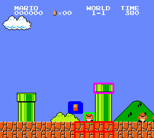

# CITS3001 Project

Completed by Mathew Cook (23222623) and Simon Eason (23389488).

The two agents created as part of this project are a simple rule-based agent, and a more complex Proximal Policy Optimisation (PPO) agent.

## Analysis

### Agent 1

This agent is based upon a simple set of rules that determines what actions to take at a given time. A series of templates are loaded into memory, containing the different tiles that appear in the game. Using OpenCV, the program determines which of these tile sets appear on the screen and where using the custom ``detect_objects()`` and ``detect_all_objects()`` functions, returning the found entities to the agent.

Once the location of the Mario character has been found, the area that the agent searches in (Denoted the "Region of Interest") is narrowed down to only consider the entities within a short distance of Mario, thus greatly reducing the amount of processing that needs to take place as the entire window no longer needs to be searched.

Once the location data for obstacles and Mario has been obtained, it's passed to the ruleset function ``rule_based_action()``, which then determines which action to take. This occurs for every step of the game, and the rules can be broken into two main ones:

1.   If there is an obstacle (e.g. Gooma, Koopa, pipe, step, or gap) jump over it once a certain distance away.
2.   If haven't moved after set amount of time, then most likely stuck. Move left slightly then jump right as high as possible.

The strengths of this agent are that it is relatively easy to implement (The most time consuming part being tuning values) and that it performs very consistently given a deterministic starting state.

However, the weaknesses of this approach make it less than ideal for all scenarios. It requires tuning of the specific values used in the rules to jump at the necessary times, and as a result is highly overfitted to the first level. Especially with the rule to get the agent unstuck, the values used here are tuned for locations where it was observed the agent would consistently get stuck. As development progressed, these settings had to be constantly changed to ensure it continued to reach the end.

The agent can complete the first level, and it does it consistently, but as a result of this overfitting, it is unable to complete more than that and cannot generalise to unseen levels that we have not programmed it to complete.

### Agent 2

The second agent was implemented using Proximal Policy Optimisation (PPO) from the `stablebaselines3` library. ChatGPT describes PPO as:

>   A reinforcement learning algorithm used in machine learning to train agents where they interact with the environment to learn optimal policies. It optimises the policy in a way that ensures small updates, preventing significant deviations from the current policy, and thus promoting more stable learning. PPO has been widely adopted for training agents in various applications, including robotics and game playing.

This algorithm has been trivially implemented for this agent, taking the environment and performing pre-processing steps, then passing it to a PPO class and allowing it to learn. Pre-processing was used to speed up the learning process, and includes:

1.   Grey-scaling the environment - Reduces the amount of data passed to the algorithm by removing colour channels.
1.   Vectorising the environment - Converts the environment to one the algorithm can understand.
1.   Stacking environment frames - Gives the algorithm motion data about how things change over time.

As the algorithm runs and learns, we have configured it to save the model at set intervals to allow for viewing of the agent's progress over time. Using Nvidia's CUDA GPU platform, the agent was trained on our computers using the graphics card.

[talk about strengths and weaknesses (training time), generalisation to unseen levels and transfer learning (training it on v3 and will test model on v0)]

## Performance metrics

In terms of measuring performance, the rule-based agent is pretty simple. Given a consistent/predetermined starting state and the current tuned values, the agent will always complete the first level. However, as previously stated, these values are set specifically for this first level, and would require tweaking to work on subsequent levels.

The number of iterations/length of time it would take to adjust these values to work on different levels is solely dependent of the speed of the programmer. It would be possible to come up with a database of values, one set per level, then load the respective values for a level when that level is progressed to. This is a way this type of agent could be generalised to work across the whole game, rather than just single levels. 

Additionally, the types of rules used and how they are implemented are flexible. The rule-based agent created for this project measures the distance from obstacles, then jumps at the appropriate time to avoid them. Different rules could be created to, for example, kill as many enemies as possible and get the highest score. This could even be achieved with the current approach by increasing the distance the agent jumps, so that is lands on the enemies' head.

From anecdotal observation, it took the PPO agent (Agent 2) approximately 250k steps to complete the first level when training in the `gym-super-mario-bros-v3` environment. When running on a computer with an Nvidia GTX 1070ti, it took 45 minutes for the algorithm to be trained to this level. In comparison to the amount of time it took to tune the rule-based agent, this isn't actually very long, however the PPO agent only completed the first level once with that level of training, and was still very inconsistent with its performance (i.e. How far to the right it got), often dying upon encountering the first obstacle. Many hours, sometimes days of training are required to get the PPO agent to a consistently performing state.

## Visualisation and debugging

The rule-based agent uses custom optical template recognition functions that return the location of desired templates, namely the location of the Mario player character, the location of moving enemies (e.g. Goomba, Koopas) and the location of static obstacles (e.g. pipes, gaps, etc.). This collection of location data is passed to the function `draw_borders_on_detected_objects()`, which draws coloured borders around the templates that have been detected in the scene. An example of this is shown below:

By restricting the borders to only be drawn in the area the agent is looking for obstacles, it is possible to see what the agent sees, and thus fine tune the rules that define how early the agent should jump to clear the obstacle.